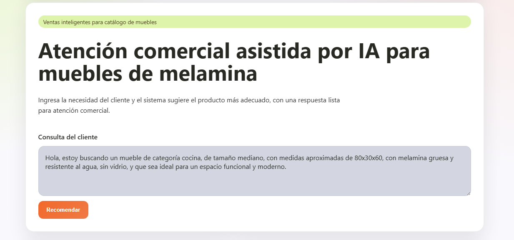
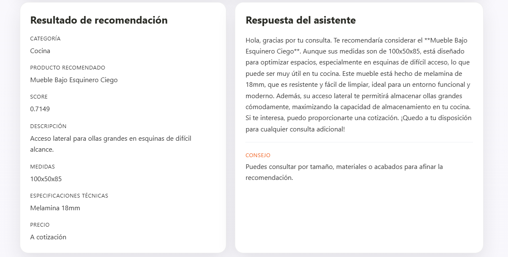

Esta aplicación es un recomendador local v.1.0 diseñado para una empresa de muebles de melamina. Permite recibir la consulta de un cliente, analizar un catálogo de productos utilizando embeddings con sentence-transformers, y devolver el producto más adecuado junto con una respuesta comercial generada mediante OpenAI.

El sistema está construido con FastAPI en el backend y cuenta con una interfaz web simple en el frontend, enfocada en facilitar la interacción y validación del modelo.

## Capturas del frontend

_Pantalla inicial para escribir la consulta del cliente._

_Vista del resultado con el producto recomendado y la respuesta generada._